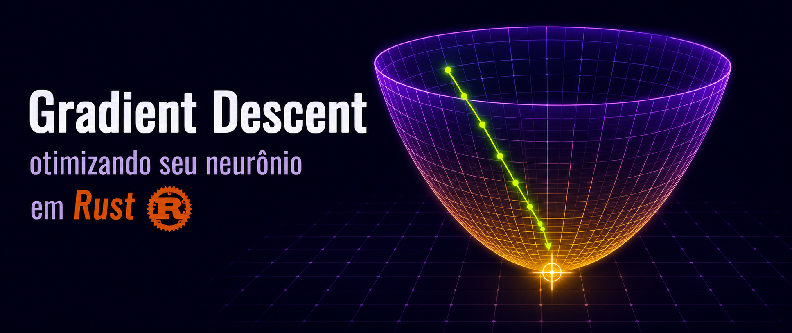

## IA do zero: Gradient Descent — opimizando seu neurônio em rust

  

Você já usou o GPT, mas sabe o que existe dentro dele? Neste post vamos ensinar o neurônio a melhorar suas previsões de forma inteligente usando **gradient descent**, o algoritmo que está por trás de praticamente todo o aprendizado de máquina moderno.
